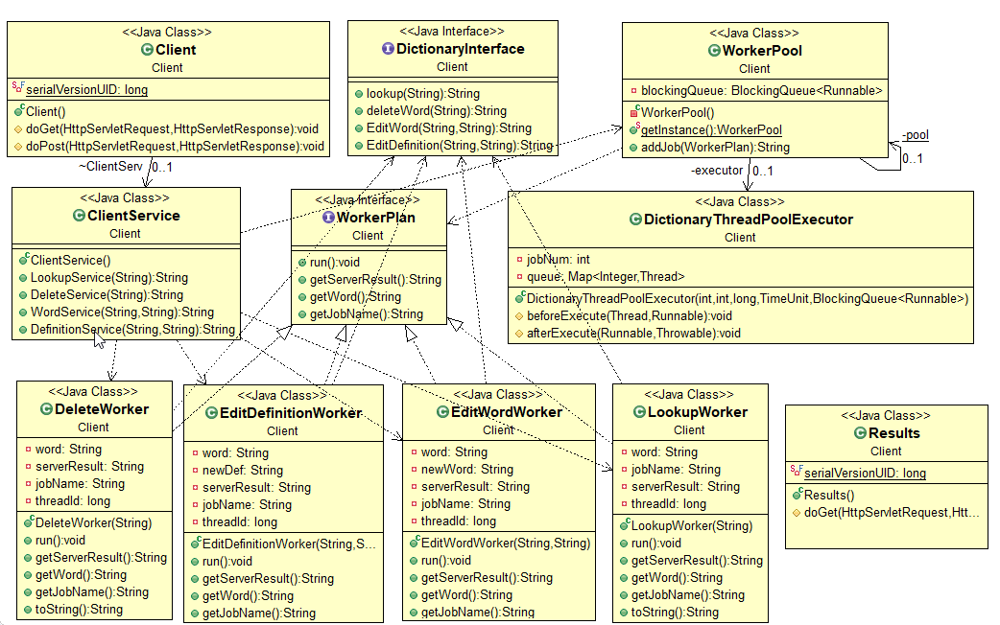
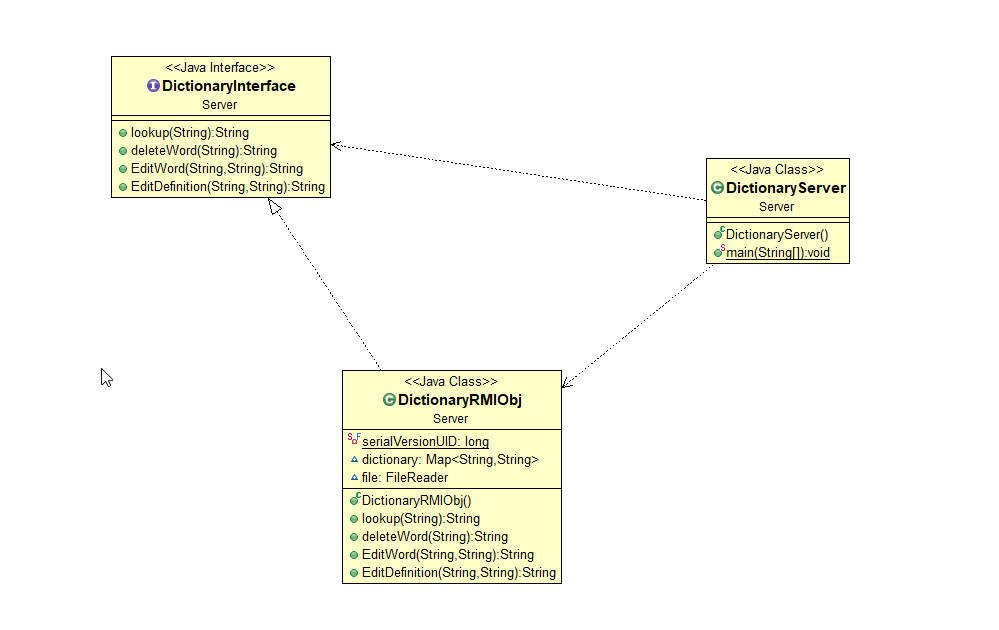

- Name: Conor Tighe
- Id: G00314417
- Module: Distributed Systems

# Overview:
This is a multi-threaded distributed dictionary web service. A client hosted by tomcat that takes input from a user on a JSP page and sends it to a RMI server to interact with a full dictionary, you can look up words, look up definitions and delete or edit words. Once a request is made the client thread will poll the server every 10 seconds until it gets a response.

### Dictionary 
I found a dictionary online, copied it into notepad and used regular expression to get rid of white lines and formatted it in a way that I could loop through and split the word and definition into 2 Strings. I then put these 2 strings in a HashMap that is created when the server starts, the client interacts with the HashMap to get results.

## Running the app:
The project itself works fine but I ran into problems converting the Maven project into a WAR file and couldn't find a solution, there is a JAR file for the server but once you connect to the RMI throws security errors. In order to run the client you have to import the project in eclipse as a Maven project and use the following run config:
```
    tomcat7:run
```

The server is run as a normal project. Once both the server and client are executing go to port 8080 to use the app. 
```
    http://localhost:8080/
```

### Login:
- Username: DSProject
- password: password

## Tomcat:
The client runs on Tomcat 7 which is taken care off through a Maven plug-in:
```pom.xml:
    <build>
        <pluginManagement>
            <plugins>
                <plugin>
                    <groupId>org.apache.maven.plugins</groupId>
                    <artifactId>maven-compiler-plugin</artifactId>
                    <version>3.2</version>
                    <configuration>
                        <verbose>true</verbose>
                        <source>1.7</source>
                        <target>1.7</target>
                        <showWarnings>true</showWarnings>
                    </configuration>
                </plugin>
                <plugin>
                    <groupId>org.apache.tomcat.maven</groupId>
                    <artifactId>tomcat7-maven-plugin</artifactId>
                    <version>2.2</version>
                    <configuration>
                        <path>/</path>
                        <contextReloadable>true</contextReloadable>
                    </configuration>
                </plugin>
            </plugins>
        </pluginManagement>
    </build>
```

# Architecture:

Client:


Serverside:


### Technologies used:

- Maven
- Tomcat 7
- RMI
- Java

## References:

-[RMI Tutorial](http://www.ejbtutorial.com/java-rmi/a-step-by-step-implementation-tutorial-for-java-rmi)

-[Java Multithreading](https://www.tutorialspoint.com/java/java_multithreading.htm)

-[Tomcat Maven Plugin](http://tomcat.apache.org/maven-plugin-2.0/tomcat7-maven-plugin/)

-[Dictionary](https://raw.githubusercontent.com/sujithps/Dictionary/master/Oxford%20English%20Dictionary.txt)